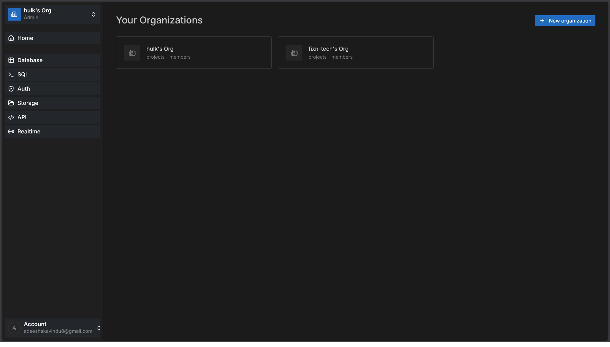
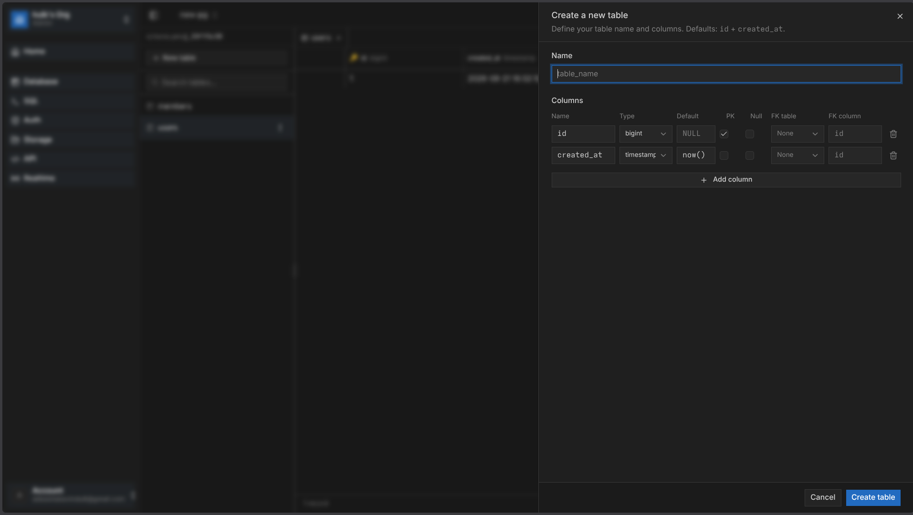
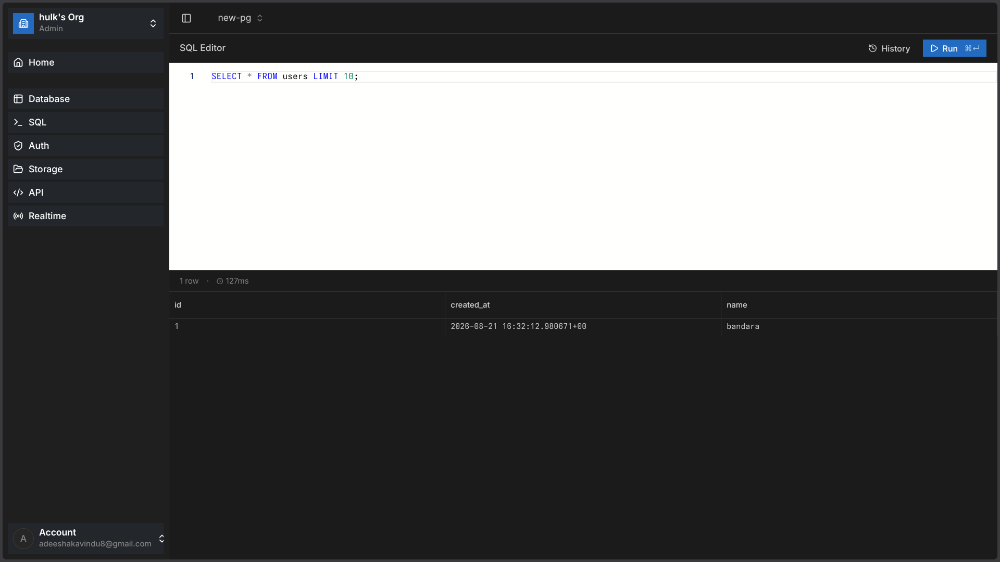
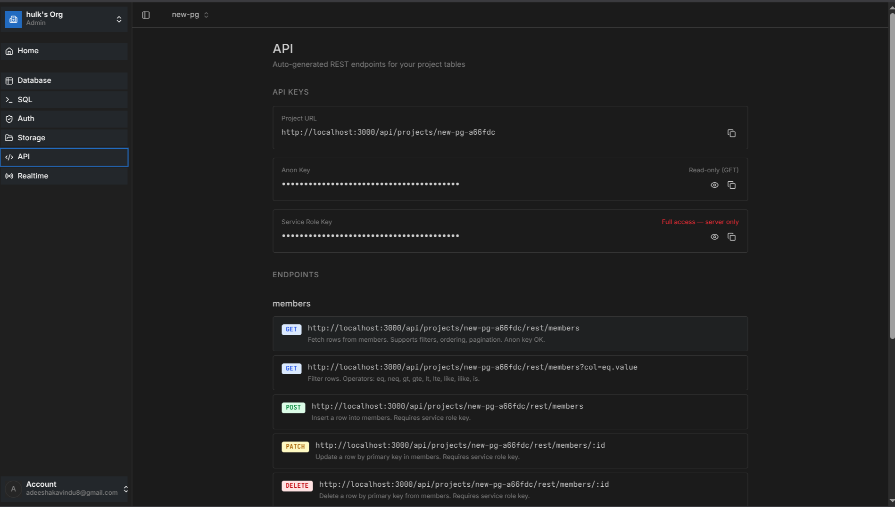

# Qube

Qube is a unified developer workspace for managing PostgreSQL project schemas, editing data, running SQL, and exposing table-backed REST endpoints.

## Overview

Qube brings database management and API development into the same project workflow. Teams can organize work by organization and project, provision an isolated PostgreSQL schema for each project, shape tables visually, inspect and update data, execute SQL, and use the generated REST interface for project tables.

It is designed for developers and small teams that want a focused, schema-first workflow instead of maintaining separate tools for database administration and table APIs.

```text
Organization
      ↓
Project (dedicated PostgreSQL schema)
      ↓
Tables and schema
      ↓
Table Editor / SQL Editor
      ↓
Generated REST endpoints
```

## Features

### Organizations and projects

- Create organizations and projects.
- Invite organization members by email, assign `admin` or `developer` roles, and remove members.
- Protect organization and project operations with cookie-based JWT authentication and organization-role guards.
- Provision a distinct PostgreSQL schema and project API keys when a project is created.

### PostgreSQL database workspace

- Browse tables in a project's schema and inspect columns, defaults, primary keys, and foreign-key relationships.
- Create and delete tables; add and drop columns.
- Create columns with `text`, `integer`, `bigint`, `boolean`, `timestamp`, `uuid`, `jsonb`, or `numeric` types.
- Configure nullability, defaults, primary keys (including composite keys), and foreign-key references when creating a table.
- Browse paginated rows and update a row by a supplied primary-key column from the Table Editor.

### SQL Editor

- Write and run one SQL statement at a time in the project's schema context.
- View returned columns, rows, command metadata, execution time, and errors in the web application.
- Store and retrieve the 50 most recent query-history entries for a project.
- Reject empty or multi-statement requests and block `DROP DATABASE`, `DROP SCHEMA`, and `TRUNCATE` statements.

### Generated REST API

Each project table is automatically available through the project's REST base URL; no endpoint definitions are stored separately. The dashboard derives endpoint documentation from the project's current table list.

For a table named `users`, Qube exposes:

```text
GET     /api/projects/:projectSlug/rest/users
POST    /api/projects/:projectSlug/rest/users
PATCH   /api/projects/:projectSlug/rest/users/:id
DELETE  /api/projects/:projectSlug/rest/users/:id
```

- `GET` accepts an anonymous project key and supports field selection, filters (`eq`, `neq`, `gt`, `gte`, `lt`, `lte`, `like`, `ilike`, `is`), ordering, limit, and offset.
- The controller includes `POST`, `PATCH`, and `DELETE` handlers guarded by the service-role key. `PATCH` and `DELETE` are designed to resolve a table's primary key to target the row.
- The write layer is not yet production-complete: the current `POST` SQL value assembly and `PATCH` service call contain implementation issues. Treat service-role writes as in progress until those paths are corrected and covered by tests.

## Architecture

```text
                             ┌─────────────────────────────┐
                             │        Next.js web app       │
                             │  dashboard, table editor,    │
                             │   Monaco SQL editor, API UI  │
                             └──────────────┬──────────────┘
                                            │ HTTP + cookies
                                            ▼
                             ┌─────────────────────────────┐
                             │          NestJS API          │
                             │ auth · orgs · members ·      │
                             │ projects · tables · SQL      │
                             └───────┬──────────────┬───────┘
                                     │              │ Bearer project key
                                     │              ▼
                                     │    ┌─────────────────────────┐
                                     │    │ Generated project REST  │
                                     │    │ endpoints per table     │
                                     │    └───────────┬─────────────┘
                                     │                │
                                     ▼                ▼
                         ┌────────────────────────────────────┐
                         │ PostgreSQL (Neon serverless driver) │
                         │ Drizzle metadata + project schemas  │
                         └────────────────────────────────────┘
```

The backend stores application metadata—users, organizations, memberships, projects, and SQL history—in PostgreSQL using Drizzle ORM. A project receives its own PostgreSQL schema, which is used by the Table Editor, SQL Editor, and table-backed REST API.

## Tech stack

| Area | Technologies |
| --- | --- |
| Frontend | Next.js 16, React 19, TypeScript, Tailwind CSS 4, Radix UI, TanStack Table, Monaco Editor |
| Backend | NestJS 11, Express platform, TypeScript |
| Database | PostgreSQL via the Neon serverless driver |
| Data access and migrations | Drizzle ORM and Drizzle Kit |
| Authentication | JWT, HTTP cookies, bcrypt; Google and GitHub OAuth flows |
| Validation | class-validator / class-transformer (API), Zod and React Hook Form (web) |
| Email | Resend organization invitations |
| Tooling | ESLint, Prettier, Jest, Dockerfiles for web and API, Wrangler web deployment script |
| Workspace | pnpm workspaces with shared `@qube/constants` and `@qube/types` packages |

## Project structure

```text
.
├── apps/
│   ├── api/
│   │   ├── drizzle/                 # Drizzle migrations and metadata
│   │   ├── src/
│   │   │   ├── auth/                # Local/OAuth auth and guards
│   │   │   ├── db/                  # Drizzle service and application schema
│   │   │   ├── members/             # Memberships and invitations
│   │   │   ├── orgs/                # Organizations
│   │   │   ├── project-api/         # Table-backed REST API
│   │   │   ├── projects/            # Project and schema provisioning
│   │   │   ├── sql-editor/          # Query execution and history
│   │   │   └── table-editor/        # PostgreSQL schema and row operations
│   │   └── test/
│   └── web/
│       ├── src/app/                 # Next.js routes and layouts
│       ├── src/components/          # UI components
│       ├── src/features/            # Auth, organizations, projects, tables, SQL, API docs
│       └── public/
├── packages/
│   ├── constants/                   # Shared constants
│   └── types/                       # Shared TypeScript types
├── package.json
├── pnpm-workspace.yaml
└── README.md
```

## Getting started

### Prerequisites

- Node.js. The repository does not declare an `engines` version; use a current supported Node.js LTS release compatible with Next.js 16 and the included dependencies.
- pnpm (the repository contains `pnpm-lock.yaml` and `pnpm-workspace.yaml`).
- A PostgreSQL database reachable via a connection string. The current database driver is Neon’s serverless PostgreSQL driver.

```bash
git clone <repository-url>
cd Qube
pnpm install
```

### Environment configuration

No `.env.example` file is included. Create local environment files from the variable names used by the applications; do not commit them.

`apps/api/.env` requires the following configuration:

```text
PORT
WEB_URL
API_URL
DATABASE_URL
JWT_ACCESS_SECRET
JWT_REFRESH_SECRET
JWT_ACCESS_EXPIRES_IN
JWT_REFRESH_EXPIRES_IN
GOOGLE_CLIENT_ID
GOOGLE_CLIENT_SECRET
GOOGLE_CALLBACK_URL
GITHUB_CLIENT_ID
GITHUB_CLIENT_SECRET
GITHUB_CALLBACK_URL
RESEND_API_KEY
INVITE_SECRET
PROJECT_JWT_SECRET
```

`apps/web/.env` uses:

```text
NEXT_PUBLIC_API_URL
API_URL
```

The API listens on port `3000` by default and serves routes under `/api`; the web development server uses port `3001`. Configure `WEB_URL`, `API_URL`, and the web API URLs consistently. OAuth credentials are used by the Google and GitHub sign-in routes, while Resend credentials are used when sending organization invitations.

Apply the database migrations after setting `DATABASE_URL`:

```bash
pnpm --filter api db:migrate
```

Then start both applications:

```bash
pnpm dev
```

Or run them separately:

```bash
pnpm dev:api
pnpm dev:web
```

## Development commands

| Command | Description |
| --- | --- |
| `pnpm dev` | Start the API and web development servers concurrently. |
| `pnpm dev:api` | Start the NestJS API in watch mode. |
| `pnpm dev:web` | Start the Next.js app on port 3001. |
| `pnpm --filter api build` | Build the API. |
| `pnpm --filter web build` | Build the web app. |
| `pnpm --filter api lint` | Run the API ESLint script (it uses `--fix`). |
| `pnpm --filter web lint` | Run web linting. |
| `pnpm --filter api test` | Run API unit tests. |
| `pnpm --filter api test:e2e` | Run API end-to-end tests. |
| `pnpm --filter api db:generate` | Generate Drizzle migrations. |
| `pnpm --filter api db:migrate` | Apply Drizzle migrations. |
| `pnpm --filter api db:push` | Push the Drizzle schema to the database. |
| `pnpm --filter api db:studio` | Open Drizzle Studio. |
| `pnpm deploy:web` | Run the configured Wrangler web deployment command. |

## Core workflow

1. Register or sign in, then create an organization.
2. Create a project; Qube provisions a PostgreSQL schema and creates anon and service-role project keys.
3. Use the Database view to create tables and configure their columns and relationships.
4. Browse table rows and update values from the Table Editor.
5. Run one-off SQL in the SQL Editor and review its saved execution history.
6. Open the API view to retrieve the project URL, keys, and dynamically derived REST examples for each table.
7. Call the project REST read endpoints with the anon key. The service-role write routes are present but should be treated as in progress (see Generated REST API).

## 📸 Screenshots

### Dashboard



### Table Editor



### SQL Editor



### API Manager



These image paths are documentation placeholders; screenshot assets are not currently included in the repository.

## Security considerations

- Keep `DATABASE_URL`, JWT secrets, OAuth client secrets, Resend keys, and the project service-role key server-side. Never commit environment files.
- The service-role key permits REST writes and should never be exposed to untrusted clients. The anon key is read-only in the current implementation, but it still grants access to table reads.
- SQL execution is an authenticated project operation. Production deployments should use database credentials and PostgreSQL permissions appropriate to the level of SQL and schema access granted by Qube.
- Configure CORS via `WEB_URL` for the deployed web origin, and use HTTPS in production.
- Review and harden generated API access, key rotation, and database authorization for production use; the code issues long-lived project JWTs and does not provide a key-rotation interface.

## Roadmap

### Available today

- Organization membership and invitation flows
- Project-scoped PostgreSQL schemas
- Table and column management
- Row browsing and primary-key row updates
- SQL execution and query history
- Table-backed REST reads and in-progress service-key write handlers
- Dashboard-generated REST endpoint examples

### Potential improvements

- API key rotation and finer-grained API authorization
- Role-based or row-level access policies for generated APIs
- OpenAPI/Swagger output and versioned APIs
- Rate limiting, API analytics, and database analytics
- Saved queries, richer history, and SQL autocomplete
- Additional database engines and collaboration features

## Contributing

Contributions should preserve the pnpm workspace layout and shared packages. Create a focused branch, make the change, and run the relevant checks before opening a pull request:

```bash
pnpm --filter web lint
pnpm --filter api lint
pnpm --filter api test
```

If your change affects the database schema, generate and include the relevant Drizzle migration under `apps/api/drizzle/`. Do not add credentials or other secrets to commits.

## License

No repository-wide `LICENSE` file is included. The API package is marked `UNLICENSED` in its package metadata.
